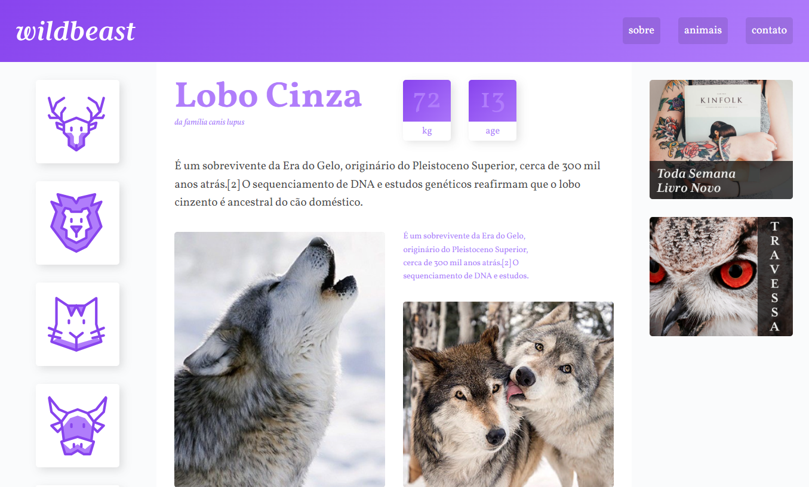

# 🐆 Projeto Wildbeast - Curso CSS Grid Layout

Este projeto foi desenvolvido durante o curso **CSS Grid Layout** da [Origamid](https://www.origamid.com/),com o objetivo de aprofundar os conhecimentos sobre criação de layouts com CSS Grid.

 

## 👉 Visualize o projeto [aqui](https://roberta-silva.github.io/wildbeast/)✨

## 📄 Sobre

- O foco principal foi praticar e dominar o uso do Grid Layout no CSS.
- A proposta inclui a construção de uma interface visualmente atraente, com layout 100% responsivo, adaptando-se a diferentes tamanhos de tela.

## Tecnologias

